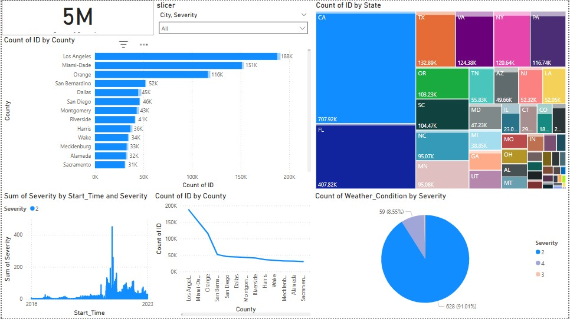

# US Accidents Analysis Dashboard

This project analyzes US traffic accidents using a large dataset from Kaggle and visualizes key insights using Power BI.

## 📊 Dashboard Highlights

- **Total Records**: 5 Million+
- **Top Counties**: Los Angeles, Miami-Dade, Orange
- **State-wise Heatmap**: CA, FL, TX lead in accident counts
- **Weather Analysis**: Severity distribution under different conditions
- **Trend Line**: Shows peaks in accident severity over time
- **Interactive Slicers**: Filter by City and Severity

## 📁 Folder Structure

- `dashboard/` – Power BI dashboard (.pbix)
- `data/` – Raw and cleaned datasets used for analysis
- `scripts/` – Python code for data cleaning
- `index.html` – A simple website to showcase the project
- `style.css` – Styles for the website

## 🛠 Tools Used

- Python (Pandas, Seaborn, etc.)
- Power BI
- HTML/CSS
- Git & GitHub

## 📬 Contact

Created by Sanjana – feel free to connect!
